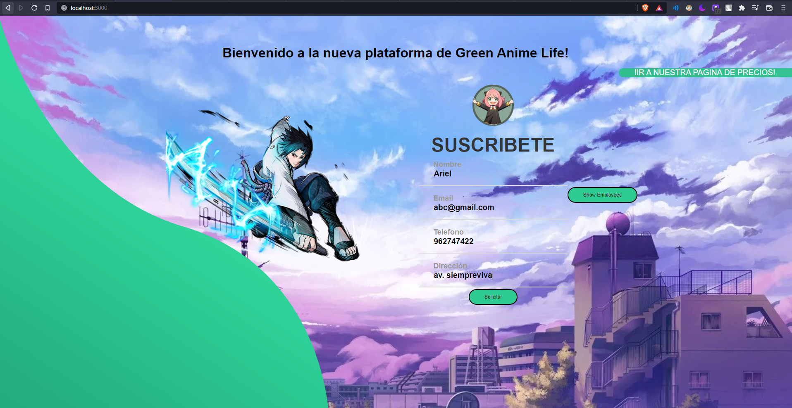
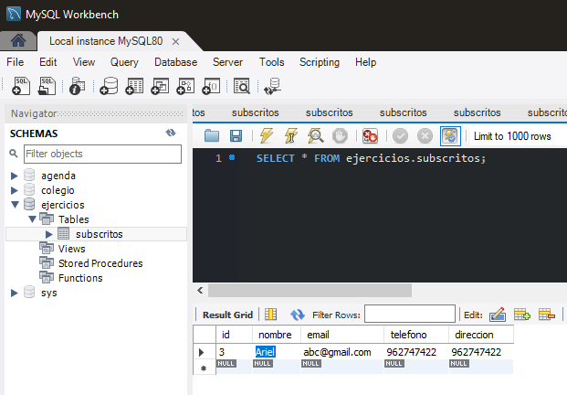
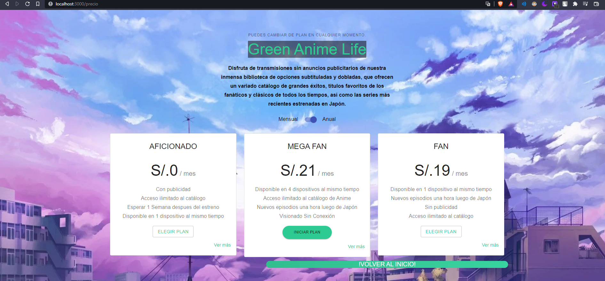

# ReactJS LANDINGPAGE

> Este proyecto utiliza 2 proyectos de NodeJS, uno siendo el server (BackEnd) y el Otro el Client (FrontEnd)



## INSTALACIÓN

```bash
# Una vez descargado nuestro proyecto:
#Entramos a la carpeta de "client"
cd client
# Instalamos las dependencias del server
npm install
# Luego entraremos a la carpeta de "server", primero salimos
cd ..
# Y recien entramos a la carpeta de "server"
cd server
# Instalamos las dependencias
npm install
```

```bash
# Para iniciar en la carpeta "client" escribiremos: 
npm start 

# y Para iniciar en la carpeta "server" escribiremos: 
node index.js

```


>El cliente se encuentra en : http://localhost:3000
>El server se encuentra en el puerto 3001